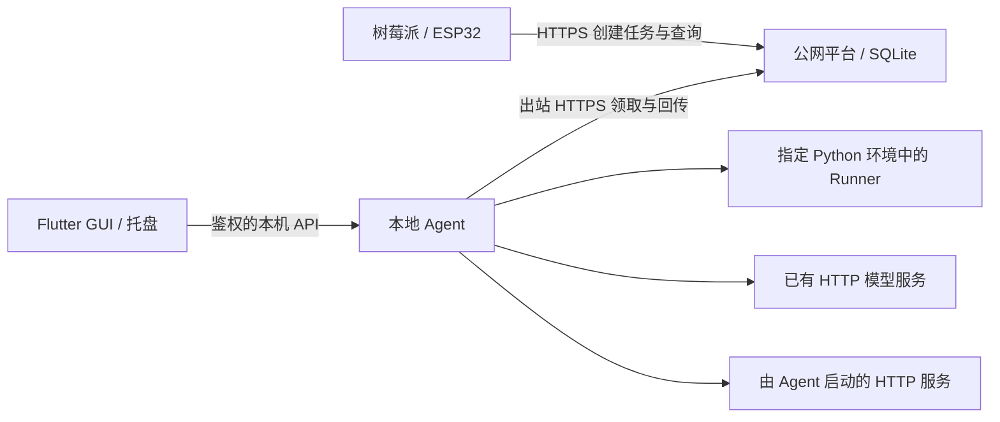

# ModelCourier 桌面工作台设计

日期：2026-09-20。状态：设计自审完成，待用户审阅；尚未开始实现计划。

## 1. 用户意图与范围

用户已有树莓派/ESP32、本地 GPU PC，以及 2C2G / 40 GB 公网服务器。PC 无法接受公网入站连接，也不会长期在线。模型分布在已有 Conda/Python 环境中，部分通过本地 HTTP 服务调用。目标是让用户通过桌面界面接入这些模型，然后一键开始/暂停为设备处理任务。

已确定：Flutter 桌面 GUI、独立 Python Agent、可扩展适配器；公网服务器继续承担轻量任务协调。用户明确要求在实现计划开始之前暂停。

本设计采用的默认范围：Windows x64 优先、单用户单平台配置、默认中文界面、单任务串行执行。保留其他桌面系统的模块边界，但首版不承诺跨平台安装包。桌面自身携带运行时，不要求用户为客户端安装 Python；模型依赖仍在用户指定的环境中。

成功标准：用户无需修改客户端源码，即可接入受支持的现有 Python 模型或 HTTP 服务；本地试运行通过后启用接单；重开软件可恢复配置；出错时能知道失败环节和下一步操作。

## 2. 方案选择

| 方案 | 优点 | 代价 | 结论 |
| --- | --- | --- | --- |
| Flutter + 独立 Agent | 界面与推理隔离，可管理托盘、进程、环境；复用 Python 核心 | 需要本地通信、打包和版本协商 | 采用 |
| 本地网页 + Agent | 可较快验证交互 | 用户仍需管理后台程序和浏览器入口 | 不作为首版入口 |
| 每个环境独立 Worker | 易沿用当前环境隔离方式 | 凭证、进程和配置重复，难统一调度 | 保留现有无界面用法，不作为桌面流程 |

Flutter 是用户确定的技术选择。分发时整理客户端、运行时、插件的许可证和第三方声明；具体依赖清单在后续选型时核验，本设计不作法律保证。

## 3. 系统边界

Flutter 负责配置、状态呈现、本地文件选择、测试、托盘和用户操作。Agent 是配置与任务状态的唯一权威，负责平台连接、领取、租约、调度、Runner、HTTP 调用、结果暂存及回传。模型框架不能导入 Flutter 或 Agent 主进程。

GUI 是用户会话内程序，首版不安装系统服务。关闭窗口保留托盘和 Agent；明确退出会停止 Agent。GUI 崩溃时 Agent 完成已领取任务但停止领取新任务，重启 GUI 后重新连接，不创建第二个 Agent。通过用户级单实例锁防止重复接单。

## 4. 接入概念与扩展点

运行环境、调用协议、模型能力彼此独立。Conda 不是调用协议：同一个 Conda 环境既能运行 Python Runner，也能启动 HTTP 服务。

| 对象 | 内容与职责 |
| --- | --- |
| EnvironmentProfile | ID、Conda 前缀或解释器路径、检测结果；定位执行环境 |
| ExecutionProfile | Python Runner、外部 HTTP、受管 HTTP 三种；包含环境引用或连接配置 |
| AdapterDescriptor | 适配器 ID/版本、能力协议、配置表单描述、检查与输出转换规则 |
| ModelBinding | 稳定 ID、用户名称、服务 ID、执行配置、适配器、模型参数、启用与加载策略 |
| PlatformProfile | HTTPS 地址、Worker 身份、凭证引用、协议兼容信息 |

EnvironmentResolver 解析和检查环境；RunnerFactory 创建执行后端；ProtocolAdapter 转换模型请求与响应；ProviderFactory 继续承担已有能力发现接口。适配器描述必须可在不导入模型框架时读取。

表单描述首版只支持字符串、数字、布尔、枚举、路径和秘密引用，以及字段校验/条件显示；不执行插件提供的 Dart 或界面脚本。新增适配器在这些组件范围内无需修改 Flutter 核心。

现有环境不会自动暴露任意模型的调用方式。受支持模板使用适配器；自定义 Python 代码须满足 Runner 桥接契约，任意脚本不能承诺零配置运行。

## 5. 用户流程与页面

### 首次启动

1. 填写平台地址和 Worker 凭证，测试连通性、身份和协议版本。初始凭证仍由现有平台管理方式签发，不把完整用户/配对系统纳入首版。
2. 添加模型，选择已有 HTTP、现有 Python 模型或受管 HTTP 服务。
3. 选择适配器模板，填写必要参数。高级配置默认折叠。
4. 检查环境/接口后，用用户选择的音频或图片做真实本地测试。样本留在本机，不自动上传平台。
5. 显示规范化结果与耗时。通过后保存并允许启用，再点击开始接单。

测试成功记录绑定配置摘要。修改环境、地址、权重或适配器后使验证失效；改显示名称不使验证失效。用户可保存未完成配置，但不能将其发布为可接单能力。

### 日常页面

- 总览：平台连接、Agent 状态、接单开关、当前任务、模型可用情况。
- 模型：添加、测试、编辑、启用、停用、加载/卸载、诊断；有活动任务时修改执行配置需排空后生效。
- 任务：本机领取历史与本地测试分开显示；任务详情显示来源、阶段、耗时、重试、错误和结果。
- 设置：平台、环境、缓存、启动行为、脱敏诊断导出。

不把本机任务历史标成平台全部队列；首版没有全平台管理页面。缺少真实推理进度时显示阶段和耗时，不伪造百分比。已完成数只计算平台确认成功的任务。

### 操作语义

- 开始接单：检查启用项，发布可接受任务的能力，再开始轮询。
- 暂停：停止新领取，继续当前任务和回传。轮询与暂停竞争时，已经取得租约的任务按当前任务处理，并在界面说明。
- 完成后退出：停止领取，完成当前任务与可完成的回传，再关闭受管进程。断网时显示未确认回传数量，允许用户选择继续等待或保留结果退出。
- 立即停止：终止本机拥有的执行，按租约报告执行失败；这不等于设备取消任务，服务端可能重试。
- 关闭窗口：首次说明进入托盘后继续工作；托盘提供打开、开始/暂停、完成后退出。
- 重开客户端：恢复配置，默认暂停接单；可显式开启“启动后自动接单”。开机启动默认关闭。

## 6. 三种执行方式

### Python 环境

自动枚举可找到的 Conda 环境与已保存解释器；提供手选 Conda 可执行文件、环境目录和 python.exe 的入口。不扫描全盘。

Conda 使用明确的 conda 可执行文件与环境前缀启动，普通 venv 使用选定解释器；所有参数通过参数数组传递，工作目录和环境变量独立配置。不能假设直接调用 Conda 中 python.exe 就等同完成环境激活。

Runner 由指定环境的 Python 启动，Agent 通过独立的标准输入/输出 JSON 行消息通信。握手包含协议版本、Python 版本和适配器版本；操作包括检查、加载、执行、卸载和关闭；消息带请求 ID。日志使用 stderr，协议输出与模型日志隔离，消息有大小上限，非法输出视为协议错误。

桥接组件与模型环境版本不兼容时停止并给出修复建议。不静默安装/升级依赖；首版展示缺失包、目标环境和可复制安装命令。已安装模型无需再次下载权重。

进程常驻策略支持执行后卸载、空闲 10 分钟卸载和保持加载。默认空闲卸载；串行执行，切换模型时先卸载旧的受管模型。超时或租约失效可终止 Runner 进程树，下一任务重新启动。

### 已有 HTTP 服务

用户选择协议模板，填写基础地址、秘密引用和模型名称。连接检测与真实推理检测分别显示。首版内置音频转录 HTTP 模板及其规范化规则，支持同步 JSON/multipart 请求和有界 JSON 响应；不宣称所有 OpenAI 风格接口都兼容。

自定义同步 HTTP 配置允许方法、相对路径、请求字段映射与响应字段路径提取，不支持任意可执行表达式。异步提交/轮询、流式响应、WebSocket、复杂响应转换留给后续协议适配器。

Agent 只连接外部服务，不启动、不关闭它。断开 HTTP 连接不能保证对方停止 GPU 推理，界面必须显示取消边界。

### 受管 HTTP 服务

用户配置可执行文件、参数数组、工作目录、环境引用、目标地址和就绪检查。启动后在默认 120 秒（可配置）的窗口内等待服务就绪，真实推理测试通过后允许启用。首版只管理前台进程；禁止把自行守护/后台脱离的命令标为受管。

端口已占用时提示用户改端口或改用“连接已有服务”，不能把已有进程当成自己启动的服务。退出只终止自己创建的进程树，不按端口杀进程。

## 7. 本地通信、存储与分发

GUI 与 Agent 使用版本化 loopback HTTP API，首版状态每秒轮询；日志采用游标读取，限制批次和总保留量。API 覆盖状态、环境探测、模型配置、测试、接单控制、任务历史和退出。控制操作返回操作 ID，可重连查询，防止界面超时后重复执行。

Agent 仅监听 127.0.0.1 随机端口；每次启动生成高熵会话凭证，通过仅当前用户可读的启动信息交给 GUI。每个接口（包括读取）需要鉴权，拒绝跨站 Origin，不启用任意来源 CORS。平台凭证不作为本机 API 凭证。

配置与历史存入用户应用数据目录的 SQLite；模型目录只引用，不复制。平台和 HTTP 密钥使用操作系统秘密存储，数据库存引用；不可用时明确报错，不能降级到明文保存。凭证不出现在进程命令行、日志、配置导出中。

本地结果暂存默认总量上限 1 GiB，保留最长 24 小时；确认成功或过期后清理。磁盘不足时暂停领取，不能删除未回传结果来腾出接单空间。日志默认 7 天且总量最多 100 MiB。暂存中的租约秘密受当前用户访问权限保护。

安装包包含 Flutter 程序和独立 Agent 运行时，不含 CUDA、模型框架或模型权重。GUI/Agent 做版本握手，不兼容时禁止接单并要求修复安装。首版手动更新，更新前排空任务；数据库迁移前备份，不支持旧版本直接读写新 schema。

## 8. 任务状态、离线与调度

平台连接、接单状态和模型状态分别呈现。模型状态为未配置、待验证、可按需加载、加载中、就绪、忙碌、错误、已停用。“可按需加载”允许领取，加载时间计入执行期限。

任务本地阶段为领取、下载、加载、执行、待回传、已确认成功、失败或租约失效。平台状态仍为协议 v1 的权威状态，不将本地“执行结束”直接显示成任务成功。

首版全局最大执行数为 1，本地测试与远程任务共享执行槽；接单过程中本地测试等待当前任务结束并临时暂停领取。外部 HTTP 服务自身的并发和显存不受 Agent 保证，不展示未经测量的显存预算承诺。

网络暂时异常采用带抖动退避，初始 1 秒、上限 30 秒，429 遵循 Retry-After。401/403 暂停接单并要求修复凭证。心跳明确拒绝时停止受管执行；外部 HTTP 尽力取消并丢弃过期结果。联系不上平台超过已知租约截止时间也停止执行，不能无限脱机推理。

推理完成后先原子保存结果及租约信息，再提交平台。响应丢失时重试相同结果，依赖服务端对相同租约/结果的幂等处理；必须验证现有行为并补齐。租约冲突不改为新租约回传。Agent 重启后只恢复结果回传和状态核对，不从未知进度续跑推理。

## 9. 公网协议与现有代码衔接

当前事实：WorkerRuntime 使用当前环境中的 ProviderFactory 和 multiprocessing ProcessRunner；不支持任意解释器切换，缺少持久化回传队列；心跳异常仅停止心跳线程，未通知执行器终止。GUI 功能依赖这些能力的实际补齐，不能只包装当前启动脚本。

现有服务端有能力注册、租约、心跳、失败与结果接口，可复用。新增桌面能力通过显式平台功能协商检查，保持旧 Worker 和旧任务兼容。

必要的协议扩展：

- 在 TaskRequirements 和 CapabilityManifest 增加可选 service_id，用于稳定逻辑服务路由；不传时沿用现有 provider/model 路由。明确指定但不存在时保持排队直到 TTL，不能随意替换服务。
- service_id 为稳定机器标识，显示名称可改。同一 owner 下相同 service_id 必须绑定相同任务协议。更换后端只对未来领取生效，执行中的配置冻结；若设备还指定了 provider/model，这些约束仍需满足。
- 补充空闲 Worker 在线心跳和能力有效期；拟定 30 秒更新、90 秒视为离线。暂停发布不可接单状态，不能以旧能力永久表示在线。
- 给设备状态增加可选等待原因：无匹配配置、匹配节点离线、节点暂停或忙碌、等待调度；可用状态信息不足时返回未知，不能猜测。任务主状态仍是 queued。
- 为 Worker 提供仅限自身租约尝试的状态核对能力，支持回传响应丢失/重启后的恢复；不能依赖 Device token 查询。

以上都是待实现协议变化，不描述为现有功能。旧平台无对应能力时桌面明确显示升级要求；旧 CLI Worker 在升级平台上继续沿用原协议。服务端保持 SQLite 和单进程部署，不引入 Redis/MQ；在线记录只更新最新状态，不存无限心跳历史。

## 10. 信任与错误边界

只有本机用户能配置命令、解释器、适配器和 HTTP 目标。远端任务只能引用允许的能力与模型参数，不能携带可执行命令、模块导入路径、环境路径或目标 URL。

外部 HTTP 目标由本机用户配置，默认 loopback；手动配置局域网地址时明确显示目标。远端任务不能改变地址或请求头。进程隔离用于依赖和生命周期管理，不声称是恶意代码沙箱；自定义适配器作为用户信任的本地代码运行。

错误需标明环境检测、启动、连接、模型加载、推理、租约或回传阶段；默认展示可读原因和修复入口，详细堆栈折叠。不会因 HTTP 200 就忽略不符合任务协议的结果。导出诊断先预览脱敏内容，默认排除样本、推理正文和秘密。

## 11. 验收边界

1. 无系统 Python 的干净 Windows 环境可启动 GUI/Agent；缺少模型环境时有明确引导。
2. 两个互相独立环境的模型可分别通过本地测试与公网任务；Agent 主环境不导入它们的框架。
3. 已有 HTTP 服务可接入并执行规范化任务，退出客户端后该服务继续运行。
4. 受管服务可启动、检测就绪、处理任务并清理进程树；端口冲突不会误杀其他进程。
5. 模型配置保存、重开恢复、编辑失效验证、失败模型停止发布能力均符合设计。
6. 暂停/退出与正在轮询、执行、回传的竞争有确定结果；不产生第二个 Agent。
7. 断网、结果响应丢失、Agent 崩溃、租约过期/取消都不会将过期结果发布为成功。
8. 本地测试不会上传输入；真实远程测试明确使用平台；任务历史范围清楚。
9. 稳定服务 ID 切换兼容后端不要求设备修改，旧 provider/model 约束继续生效。
10. 本地 API 缺少凭证被拒绝；秘密不出现在日志/命令行；缓存达到上限停止领取。
11. 既有 Python 测试/协议回归通过；新增真实 Windows 环境与 GPU 验证须单列证据，不能以 Mock 测试代替。
12. 在目标 2C2G 平台实测空闲心跳、任务请求和磁盘清理；记录资源数据，不预先声称容量或性能达标。

## 12. 延后内容与自审结论

延后：模型市场、自动下载权重/创建环境、自动更新、可视化任意代码编排、异步/流式模型协议、多 GPU 调度、多用户共享、远程控制本机配置、实时语音、平台完整管理 GUI。首版能力仍是语音转录和图像检测，其他任务类型后续扩展版本化协议。

自审已核对：环境与协议没有混为一类；受管/外部进程所有权明确；关闭窗口与退出含义分开；本地成功与平台确认分开；服务别名和在线状态明确列为协议新增；当前进程执行器限制和回传缺口已记录；配置变更、租约失效、缓存上限与测试边界有可验收行为。

本文件是产品与架构设计，不包含开发任务拆分、工期或执行顺序。按用户要求停在此处，待审阅后再决定是否进入实现计划。
